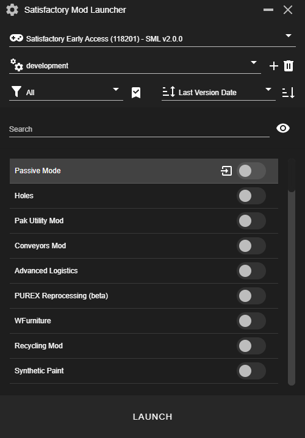
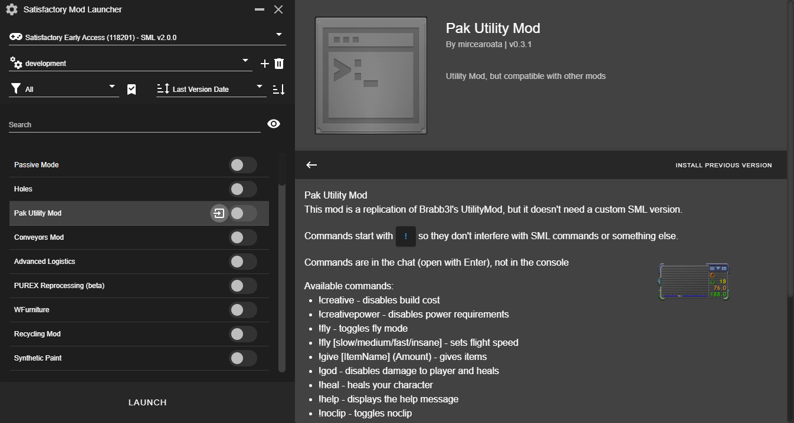
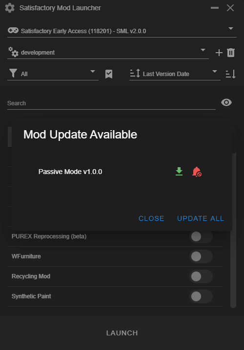
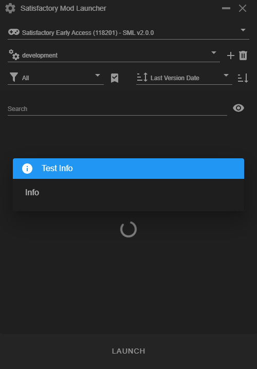
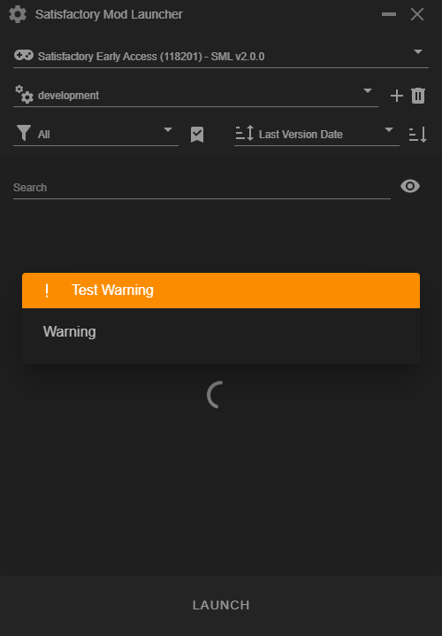
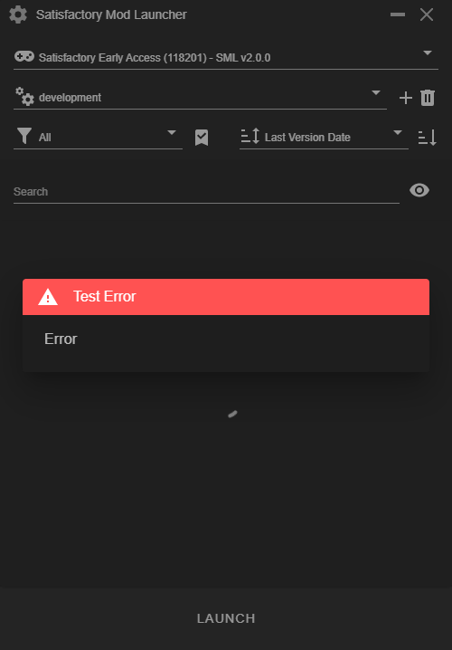

# Satisfactory Mod Launcher

Handles all the steps of installing mods, including download of SML and Bootstrapper. For questions, you can ask in the [Satisfactory Modding discord](https://discord.gg/TShj39G)

#### Installation

Download the latest release from https://github.com/satisfactorymodding/SatisfactoryModLauncher/releases

#### Usage

Just install it, choose an updated mod, and click install. Everything else is handled by SMM

#### Developmemnt
``` bash
# install dependencies
yarn install

# serve with hot reload at localhost:9080
yarn dev

# build electron application for production
yarn dist

# lint all JS/Vue component files in `src/`
yarn lint

```
<hr>

### Upcoming feature
- Toggle dark/light mode
- Favorite tag
- Mod status (Viewer, download count, etc)

### Screenshot
#### App
<div align="center">
  
</div>

#### Mod Detail
<div align="center">
  
</div>

#### Mod Update
<div align="center">
  
</div>

### info
<div align="center">
  
</div>

### warning
<div align="center">
  
</div>

### error
<div align="center">
  
</div>
